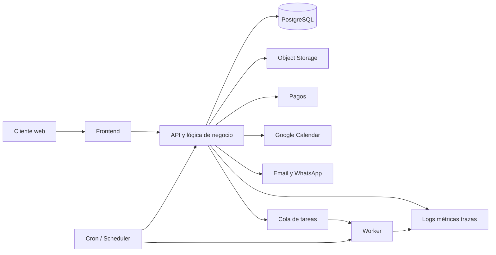

# Reporte de requerimientos para un sistema de reservas multinegocio

## Resumen ejecutivo y definición del producto

La idea no debe tratarse como “un sistema de citas para barberos y ya”, sino como una **plataforma SaaS multitenant de reservas** con un núcleo común para manejar tiempo, disponibilidad, recursos y confirmaciones. Ese núcleo debe soportar, desde el inicio, **recurrencias**, **excepciones por instancia** y **zonas horarias IANA**, porque esas tres piezas son parte del comportamiento estándar de calendarios modernos y aparecen explícitamente tanto en el estándar iCalendar RFC 5545 como en la API de Google Calendar. En otras palabras: la agenda no debe modelarse como filas simples de “fecha + hora”, sino como reglas de disponibilidad, ventanas de tiempo y bloqueos concretos. citeturn9view4turn9view5turn10view0

Tu producto base debería girar alrededor de un concepto único: **“recurso reservable”**. En unos negocios ese recurso será una persona, como un barbero; en otros será una cancha; y en otros será una combinación de personas, equipo, locación o capacidad, como pasa en una empresa que cubre eventos. Si diseñas bien ese núcleo, los verticales cambian la configuración y las reglas de negocio, pero no obligan a rehacer el motor. La decisión de diseño más importante es que la plataforma tenga una **fuente única de verdad interna** para la agenda, y que luego sincronice con calendarios externos, notificaciones o pagos, en vez de depender de terceros como sistema principal de consistencia. Esa postura es especialmente importante porque Google Calendar expone eventos, recurrencias, instancias y calendarios como recursos integrables, pero sigue siendo una integración externa, no tu dominio de negocio central. citeturn10view0turn10view1turn10view3

Mi recomendación de producto es que el **MVP** cubra muy bien tres escenarios: reservas individuales de servicios, reservas de recursos físicos por bloques, y reservas con aprobación. Eso te deja entrar a barberos, canchas y una primera versión para empresas de eventos sin construir todavía un ERP completo. La expansión natural, después del MVP, sería depósitos, cotización avanzada, paquetes de recursos, reglas más complejas de precios y un marketplace opcional.

## Lo que espero de ti como desarrollador

Si yo fuera una oficina de requerimientos contratándote como implementador, esperaría que me entregues un proyecto con decisiones explícitas y no solo código. Como mínimo, necesito de ti una **definición formal del dominio**, una **matriz de módulos del MVP**, una **arquitectura desplegable**, una **estrategia de seguridad**, una **política de datos y respaldos**, y un **plan de entregas por tarjetas**. En seguridad, la referencia razonable para una app web moderna es usar OWASP ASVS como base de controles técnicos; para autenticación, NIST SP 800-63B sigue siendo un buen marco operativo para contraseñas, MFA y rate limiting. citeturn9view6turn9view7turn11view1turn11view3

También esperaría que me confirmes, muy temprano, estas decisiones de negocio y alcance:

| Entregable esperado de ti | Qué debe responder |
|---|---|
| Documento de alcance | Qué entra al MVP y qué pasa a fase 2 |
| Lenguaje de dominio | Qué es un recurso, servicio, ubicación, disponibilidad, bloqueo, reserva, no-show, reprogramación |
| Modelo multitenant | Cómo se aislarán empresas, usuarios y datos |
| Arquitectura | Qué se despliega dónde y por qué |
| Seguridad | Cómo autenticas, autorizas, registras auditoría y limitas abuso |
| Operación | Cómo haces backups, observabilidad, colas, cron y recuperación |
| Backlog | Cómo se ejecuta el proyecto completo una tarjeta a la vez |

En términos de calidad, yo esperaría cuatro compromisos tuyos. Primero, que el sistema **no permita solapamientos** por error de concurrencia. Segundo, que el sistema trate correctamente zonas horarias y recurrencias. Tercero, que toda integración externa crítica sea idempotente y auditable. Cuarto, que el sistema pueda operar como SaaS desde el día uno, con separación robusta de datos por empresa. PostgreSQL te da herramientas muy fuertes para esas cuatro cosas: restricciones de exclusión, tipos de rango con zona horaria, aislamiento transaccional y Row-Level Security. citeturn12view1turn12view3turn9view2turn9view3

Mi expectativa contigo, siendo desarrollador solo, no sería que construyas microservicios, sino que construyas un producto que pueda venderse, mantenerse y escalar sin ahogarte en operaciones. Por eso, de entrada, yo te pediría una **arquitectura monolítica modular**, un **solo repositorio**, despliegue automatizado, y separación clara entre frontend, API, worker y cron, aunque vivan en el mismo código base.

## Requerimientos funcionales y reglas de negocio

El sistema debe tener un **núcleo funcional común** y luego configuraciones por vertical. El núcleo común debería incluir: empresas, sucursales, recursos, servicios, agenda, reglas de disponibilidad recurrente, bloqueos excepcionales, reservas, estados de reserva, clientes, notificaciones, integraciones externas, pagos opcionales, bitácora de cambios y reportes básicos. La razón técnica para empujar este diseño es que los calendarios modernos ya modelan eventos, recurrencias, instancias y excepciones como conceptos separados, y Google Calendar también distingue entre calendario, evento y ocurrencias derivadas. citeturn9view4turn9view5turn10view0

El requerimiento más importante de todo el sistema es el **control de conflictos de agenda**. No basta con validar en frontend ni con hacer un `SELECT` antes del `INSERT`. La capa correcta para blindar la reserva es la base de datos. PostgreSQL tiene tipos de rango, incluyendo `tstzrange`, y restricciones de exclusión que permiten impedir que dos filas se solapen en el mismo recurso; además, al crear la restricción puede crear el índice correspondiente. Esa es una decisión arquitectónica clave porque evita dobles reservas cuando dos usuarios intentan reservar el mismo hueco casi al mismo tiempo. citeturn12view1turn12view3turn9view3

A nivel de dominio, yo especificaría este modelo mínimo:

| Módulo | Requerimiento obligatorio del MVP |
|---|---|
| Tenant y organización | Cada negocio es un tenant separado con branding, horarios y políticas |
| Ubicaciones | Un negocio puede tener una o varias sedes |
| Recurso reservable | Persona, cancha, sala, equipo o paquete simple |
| Servicio | Duración, buffer, precio base, recurso requerido |
| Disponibilidad | Reglas recurrentes, descansos, cierres, feriados y excepciones |
| Reserva | Crear, confirmar, cancelar, reprogramar, marcar no-show |
| Cliente | Perfil, historial, consentimiento y notas internas |
| Notificaciones | Confirmación, recordatorio, reprogramación, cancelación |
| Integraciones | Calendario externo, correo, WhatsApp, pagos |
| Auditoría | Registro de quién cambió qué y cuándo |

Para **barberos**, el sistema debe soportar servicios con duración fija o variable, buffers antes o después, asignación automática o manual del profesional, y bloqueo del recurso humano. Para **canchas**, debe soportar recursos físicos por bloques horarios, precios por franja, reglas de aforo o capacidad y calendario por sede. Para **empresas de eventos**, el MVP debería entrar por un flujo híbrido: solicitud de fecha, prebloqueo, aprobación manual y conversión a reserva confirmada; la versión más compleja de paquetes y múltiples cuadrillas puede ir a una fase posterior.

Hay tres reglas funcionales que yo dejaría escritas como no negociables. La primera: **toda disponibilidad recurrente debe almacenarse como regla y no como miles de filas pre-generadas**, salvo que uses un caché temporal para consulta. La segunda: **cada reserva debe guardar la zona horaria de negocio o del recurso** usando identificadores IANA, porque Google Calendar usa esa convención y las consultas cambian de significado cuando se omite el timezone. La tercera: **cada cambio sobre una reserva debe dejar rastro auditable**. citeturn9view5turn10view0

También te pediría integración con calendario externo, pero con un enfoque prudente. La integración correcta para el MVP es **sincronización unidireccional o de “busy slots”** antes de intentar un sync bidireccional completo. Google Calendar expone eventos mediante una API REST y permite crear eventos con `events.insert`, pero para producto comercial conviene que tu sistema sea la fuente canónica y que el calendario externo funcione como espejo o como validación adicional de disponibilidad. citeturn10view0turn10view3

Si incluyes pagos desde el MVP, te pediría que lo hagas con **checkout alojado** y no construyendo tu propio formulario desde cero. Stripe Checkout redirige a una página alojada por Stripe, Stripe recomienda idempotency keys para evitar cobros duplicados, y los webhooks son la vía correcta para enterarte de eventos asíncronos como confirmación definitiva de pago o renovación. Eso reduce complejidad operativa y te deja concentrarte en la reserva. citeturn10view10turn10view11turn10view12turn9view8

## Requerimientos no funcionales, seguridad y datos

La plataforma debe nacer como **multitenant segura**. Eso implica, en la práctica, que todas las tablas funcionales relevantes tengan `tenant_id`, que las consultas estén filtradas por ese contexto y que el aislamiento no dependa solo de “acordarse” de poner un `WHERE`. PostgreSQL soporta Row-Level Security para restringir qué filas puede leer, insertar o modificar cada usuario o rol. Para un SaaS de reservas, ese soporte te sirve como defensa en profundidad y reduce el riesgo de fugas entre negocios. citeturn9view2

En autenticación, mi línea base sería esta: si implementas contraseñas, usa políticas modernas y no reglas antiguas arbitrarias de composición. NIST 800-63B indica que, cuando la contraseña es de un solo factor, debe exigirse un mínimo de 15 caracteres; si se usa dentro de MFA, puede permitirse un mínimo de 8. Además, NIST exige mecanismos de rate limiting para limitar intentos fallidos. Traducido a tu producto: login con contraseña larga o passphrase, MFA opcional desde el MVP si te alcanza, bloqueo progresivo o throttling, y recuperación de cuenta bien pensada. citeturn11view1turn11view3

Si tu app web usa autenticación con proveedores externos o integraciones en navegador, la recomendación vigente para apps browser-based es **Authorization Code Flow con PKCE**, no el flujo implícito. Eso afecta especialmente cualquier login social, conexión a Google Calendar o flujos OAuth desde SPA. citeturn10view9

Tu baseline de seguridad de aplicación debería quedar escrito sobre ASVS. En términos concretos, eso se traduce en validación de entradas, protección contra XSS e inyección, manejo seguro de sesiones, autorización por rol y contexto, protección CSRF si usas cookies, rotación de secretos, logs de seguridad y verificación de webhooks. OWASP ASVS existe precisamente como una base de verificación de controles técnicos para apps web. citeturn9view6

Para notificaciones, yo te pediría dos canales desde temprano: **correo transaccional** y **mensajería**. Twilio SendGrid está orientado a correos transaccionales como confirmaciones, reseteos y notificaciones; Twilio WhatsApp permite mensajes unidireccionales para recordatorios, alertas y avisos. En producto real, eso te sirve para confirmaciones de reserva, recordatorios automáticos y avisos de cambios de horario. citeturn9view17turn9view18

Para archivos y respaldos de documentos —por ejemplo cotizaciones, comprobantes, adjuntos o exportaciones— usaría almacenamiento tipo S3 con **versionado** y **reglas de ciclo de vida**. S3 Versioning conserva múltiples versiones de un objeto y facilita recuperación ante sobrescrituras o borrados accidentales; S3 Lifecycle permite archivar o eliminar automáticamente lo que ya no deba conservarse. Eso te sirve tanto para adjuntos de negocio como para logs exportados. citeturn10view6turn9view19

En observabilidad, el sistema debe salir con trazas, métricas y logs centralizados. OpenTelemetry es un framework abierto y neutral para instrumentar, generar, recolectar y exportar esos tres tipos de telemetría. Para un desarrollador solo, eso vale oro porque te permite saber si falló la reserva, el webhook, la cola o el recordatorio sin adivinar. citeturn9view16

## Arquitectura e infraestructura recomendadas

Mi recomendación principal es una **arquitectura de monolito modular** con estas piezas lógicas: frontend web, API/servidor de aplicación, worker asíncrono, cron/scheduler, Postgres, almacenamiento de archivos y proveedores externos. No te recomiendo microservicios. Sí te recomiendo separar responsabilidades de ejecución, aunque compartan repo y código.

La razón para mantener esa forma es sencilla: las reservas son altamente transaccionales, y el valor del producto está en no chocar horarios ni perder eventos. PostgreSQL te permite modelar tiempo con `tstzrange`, evitar solapamientos con restricciones de exclusión y usar aislamiento transaccional suficiente para operaciones concurrentes. Para escala inicial y media, eso vale más que distribuir prematuramente el sistema. citeturn12view1turn12view3turn9view3

Para despliegue, tienes tres caminos razonables.

**Camino más simple para un solo desarrollador.** Usa **Render** para la aplicación, el worker y los cron jobs, junto con Postgres administrado, y almacenamiento S3-compatible aparte. Render tiene tipos de servicio específicos para web, background workers y cron jobs; eso reduce fricción operativa y te deja administrar procesos separados sin k8s ni infraestructura pesada. citeturn9view11turn10view4turn10view5

**Camino con mejor experiencia de frontend.** Usa **Vercel** para frontend y rutas web, pero mantén la parte transaccional pesada y los workers fuera del runtime edge. Vercel Functions permite control regional y baja latencia vía CDN, pero su propia documentación indica que las Edge Functions ya están deprecadas y además advierte que ejecutar cerca del usuario puede empeorar tiempos si la base de datos está en otra región. Si eliges Vercel, para la parte de reservas usa Node.js runtime y coloca la región cerca de la base de datos. citeturn9view10turn13view0

**Camino enterprise o de mayor control.** Usa proveedor cloud con Postgres administrado. Amazon RDS for PostgreSQL ofrece snapshots, backups, point-in-time restore, Multi-AZ, read replicas y SSL. Cloud SQL for PostgreSQL automatiza backups, failover, replicación y parches, y anuncia disponibilidad superior a 99.95 %. Azure Database for PostgreSQL Flexible Server ofrece backups automáticos, restauración a punto en el tiempo, cifrado, monitoreo y alta disponibilidad con replicas primaria/standby separadas físicamente. Si tu meta es vender a clientes más formales o corporativos, este camino te deja mejor posicionado. citeturn9view12turn9view13turn10view15turn10view16

Para la base de datos, yo te propongo esta priorización realista:

| Escenario | Recomendación |
|---|---|
| MVP veloz | Supabase o Neon si quieres reducir tiempo de operación y desarrollo |
| Producción estable para SMB | Render Postgres o Cloud SQL |
| Producción con requisitos altos de continuidad | RDS, Cloud SQL o Azure Database for PostgreSQL con HA |

Supabase te da un Postgres completo, no una abstracción, y además integra Auth, Storage, Realtime y Edge Functions; también maneja backups diarios y point-in-time recovery en planes pagados. Neon es atractivo para desarrollo por su autoscaling, branching e instant restore. Para una sola persona, ambos son muy buenos aceleradores, pero si vas a vender B2B más serio y con jobs continuos, un entorno como Render más un Postgres administrado o un cloud más clásico puede darte operación más predecible. citeturn9view14turn10view7turn10view8

En colas y trabajos asíncronos, yo no intentaría meterlo todo en el request web. Los recordatorios, reintentos, sincronizaciones, limpieza de datos y procesamiento de webhooks deben salir del request principal. Si estás en GCP, Cloud Tasks es una opción muy sólida para despachar y entregar trabajo asíncrono a endpoints HTTP; si estás en Render, su modelo de background worker encaja bien con una cola o polling interno. citeturn9view15turn10view5

Mi recomendación final de arquitectura para ti, siendo freelancer solo, sería esta:

| Capa | Recomendación concreta |
|---|---|
| Patrón de software | Monolito modular |
| Frontend | Web responsive primero; panel admin + portal público |
| Backend | API HTTP + worker + cron |
| Base de datos | PostgreSQL |
| Cola | Cloud Tasks o worker con cola simple según plataforma |
| Archivos | S3-compatible |
| Observabilidad | OpenTelemetry + proveedor de logs/errores |
| Autenticación | Sesiones seguras o JWT con refresh; OAuth con PKCE donde aplique |
| Pagos | Stripe Checkout + webhooks |
| Mensajería | SendGrid + Twilio WhatsApp |

## Plan de entrega y tarjetas tipo Jira para trabajar solo

La forma correcta de ejecutar esto solo no es por “capas técnicas” infinitas, sino por **vertical slices**. Mi recomendación es que lleves WIP máximo de 1 o 2 tarjetas y que cada bloque cierre un entregable demostrable. El backlog que sigue está ordenado para que puedas producir un sistema vendible, no solo una base técnica elegante.

| Key | Tipo | Tarjeta | Resultado esperado | Dependencia |
|---|---|---|---|---|
| RES-01 | Discovery | Definir alcance formal del MVP | Documento con módulos MVP, fase 2 y exclusiones | — |
| RES-02 | Discovery | Definir lenguaje de dominio | Glosario: tenant, recurso, servicio, slot, bloqueo, reserva | RES-01 |
| RES-03 | Discovery | Matriz de verticales | Tabla comparando barberos, canchas y eventos | RES-02 |
| RES-04 | Arquitectura | Elegir plataforma de despliegue | Decisión registrada: Render, Vercel+backend, o cloud | RES-01 |
| RES-05 | Arquitectura | Diseñar modelo multitenant | Estrategia `tenant_id` + roles + políticas de acceso | RES-02 |
| RES-06 | Arquitectura | Diseñar modelo de datos base | ERD de tenants, users, resources, services, availability, bookings | RES-05 |
| RES-07 | Infra | Crear repositorio y CI/CD | Repo, ramas, lint, test y despliegue automático básico | RES-04 |
| RES-08 | Infra | Provisionar Postgres y secretos | DB, variables seguras, entornos dev/stage/prod | RES-07 |
| RES-09 | Seguridad | Implementar autenticación base | Login seguro, sesiones, recuperación y roles iniciales | RES-05 |
| RES-10 | Seguridad | Implementar autorización multitenant | Aislamiento por tenant y validaciones de acceso | RES-09 |
| RES-11 | Núcleo | CRUD de organizaciones y sucursales | Alta/edición de negocio, sedes, branding y horarios | RES-10 |
| RES-12 | Núcleo | CRUD de recursos reservables | Personas, canchas u otros recursos configurables | RES-11 |
| RES-13 | Núcleo | CRUD de servicios | Duración, buffers, precio, recurso requerido | RES-12 |
| RES-14 | Agenda | Motor de disponibilidad recurrente | Reglas semanales, descansos, feriados y excepciones | RES-13 |
| RES-15 | Agenda | Motor de slots disponibles | Endpoint/UI que calcule huecos reservables | RES-14 |
| RES-16 | Agenda | Protección anti-solapamiento en DB | Restricción real contra doble reserva | RES-15 |
| RES-17 | Reservas | Crear flujo de reserva pública | Cliente elige servicio/recurso/horario y reserva | RES-16 |
| RES-18 | Reservas | Estados y transiciones | pendiente, confirmada, cancelada, reprogramada, no-show | RES-17 |
| RES-19 | Reservas | Reprogramación y cancelación | Políticas parametrizables por negocio | RES-18 |
| RES-20 | Clientes | Módulo de clientes e historial | Perfil, últimas reservas, observaciones | RES-17 |
| RES-21 | Notificaciones | Email transaccional | Confirmación, cambio y cancelación por correo | RES-18 |
| RES-22 | Notificaciones | Recordatorios por WhatsApp/SMS | Job de recordatorios y confirmación simple | RES-21 |
| RES-23 | Integración | Google Calendar unidireccional | Crear eventos espejo desde reservas confirmadas | RES-18 |
| RES-24 | Integración | Sync de bloqueos externos | Traer busy slots para evitar choques gruesos | RES-23 |
| RES-25 | Pagos | Depósito o pago total opcional | Stripe Checkout + webhook + reconciliación | RES-18 |
| RES-26 | Administración | Panel operativo de negocio | Vista de agenda, disponibilidad, clientes, reservas | RES-20 |
| RES-27 | Reportes | Reportes básicos | ocupación, cancelaciones, ingresos simples | RES-26 |
| RES-28 | Auditoría | Bitácora de cambios | Registro de cambios sobre reservas y configuración | RES-18 |
| RES-29 | Calidad | Suite de pruebas críticas | Cobertura de overbooking, zonas horarias y permisos | RES-16 |
| RES-30 | Operación | Observabilidad | Logs, métricas, trazas y alertas mínimas | RES-07 |
| RES-31 | Operación | Backups y restauración probada | Procedimiento probado de recovery | RES-08 |
| RES-32 | Lanzamiento | Hardening y checklist release | Checklist final de seguridad, DX y soporte | RES-29, RES-30, RES-31 |

Si quisieras convertir esto a un modelo de trabajo semanal realista para una sola persona, yo lo haría así: primero discovery y arquitectura; luego núcleo de negocio; después agenda; después reservas; luego notificaciones e integraciones; al final pagos, reportes, hardening y lanzamiento. La razón para poner pagos después del core es que Stripe usa webhooks y operaciones asíncronas, y eso te conviene cuando tu motor transaccional ya está estable. citeturn9view8turn10view11turn10view12

Para que cada tarjeta sea realmente “done”, yo te pediría una definición homogénea de cierre. Cada tarjeta debe cerrar con código desplegado en staging, migración aplicada si corresponde, pruebas mínimas, logs útiles y una nota corta de lo que quedó resuelto. Esto es todavía más importante en un proyecto solo, porque tu memoria operativa es un recurso finito.

## Recomendación final y decisiones críticas antes de empezar

Mi recomendación estratégica es que construyas un **núcleo genérico de reservas** y que comercialmente entres primero por **barberos y canchas**, no por eventos complejos. No porque eventos no sirva, sino porque eventos mete antes de tiempo aprobación manual, paquetes, múltiples recursos y cotización, y eso puede retrasar tu salida al mercado. El producto correcto no es “uno diferente por industria”, sino uno con un modelo común y reglas configurables.

Si hoy tuviera que aprobarte un plan como oficina de requerimientos, te pediría que cierres estas decisiones antes de escribir demasiado código:

| Decisión | Opción recomendada |
|---|---|
| Patrón base | Monolito modular |
| Motor de tiempo | `tstzrange` + exclusión anti-solapamiento |
| Recurrencia | RRULE + excepciones por instancia |
| Multitenancy | shared schema con `tenant_id` + control de acceso fuerte |
| Sincronización externa | Google Calendar como integración, no como verdad principal |
| Pagos MVP | Opcionales, vía Stripe Checkout |
| Recordatorios MVP | Email primero; WhatsApp después o en paralelo según mercado |
| Operación | Managed services y no infraestructura artesanal |
| Observabilidad | OTel desde etapa temprana |
| Seguridad | ASVS como baseline; autenticación moderna y rate limiting |

La arquitectura que mejor balancea velocidad, costo operativo y capacidad de venta para ti hoy es: **frontend web + backend modular + worker + cron + PostgreSQL + object storage + email/WhatsApp + Stripe opcional**, desplegado sobre una plataforma administrada. Si quieres la ruta más simple, Render te resuelve bien web, workers y cron. Si quieres mejor DX de frontend, usa Vercel para la cara pública, pero mantén la lógica transaccional de reservas cerca de tu base de datos y evita depender del runtime edge para el camino crítico de escritura. Si tu objetivo desde temprano es vender a clientes más exigentes, apunta a PostgreSQL administrado en RDS, Cloud SQL o Azure. citeturn9view10turn13view0turn9view11turn10view4turn10view5turn9view12turn9view13turn10view15turn10view16

Si resumo el criterio rector del proyecto en una sola frase, sería esta: **tu producto no debe ser un calendario bonito; debe ser un motor confiable de asignación de tiempo y recursos, con integraciones alrededor**. Esa diferencia es la que te permitirá venderlo a varios tipos de negocio sin rehacerlo cada vez.
